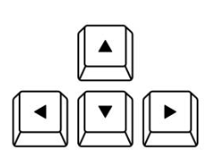
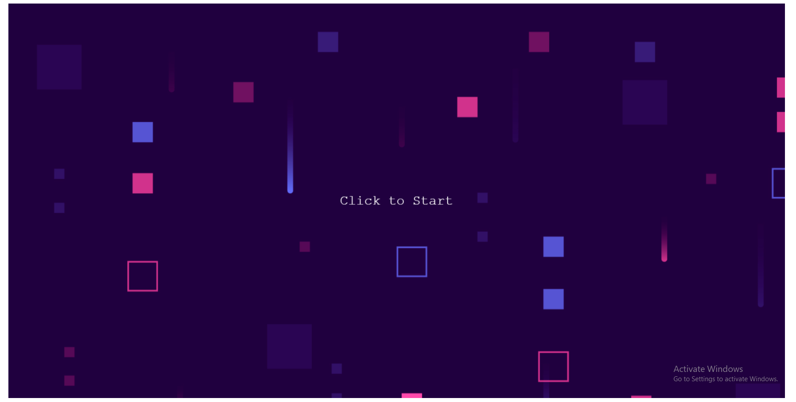
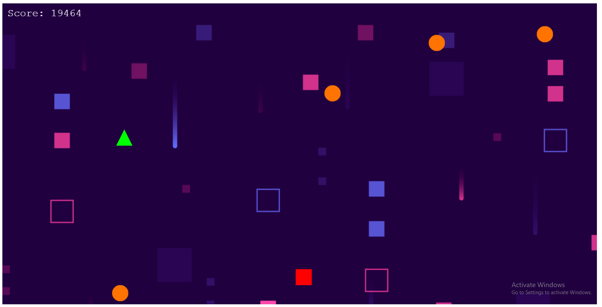
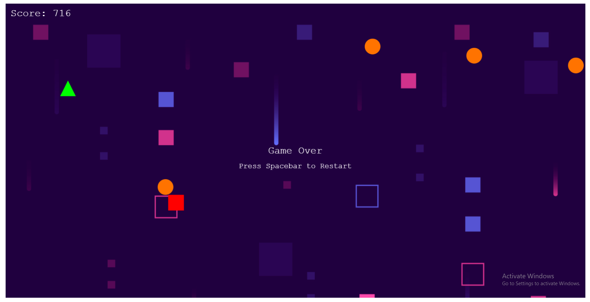

# Geometry Frenzy

### Group Members:
Muhammad Akmal Bin Mohd Zamri - 1211305211
Wong Chong Pei - 1211304884

### Intro:
The game is a simple chase game with simple shapes to represent different things
Square - Player
Triangle - Hunter
Circle - Projectiles

### Instructions:
Objective of the game is to dodge the incoming projectiles while also running from the hunter

* Arrow Keys to move the player
* Spacebar to Jump

### Screenshots:

Start Screen

In-game Screen

Game Over Screen

### Link to Video Demo
[Gameplay Video Link](https://youtu.be/tqRbACMiVt4)

### Acknowledgements
* **Wong Chong Pei** (Groupmate)
* **ChatGPT** only to correct mistakes after properly learning the code and features 

### References
For creating sprites: https://newdocs.phaser.io/docs/3.80.0/Phaser.GameObjects.Graphics

Parallax Scrolling BG: https://www.youtube.com/watch?v=-lJ2SQnbPSU
